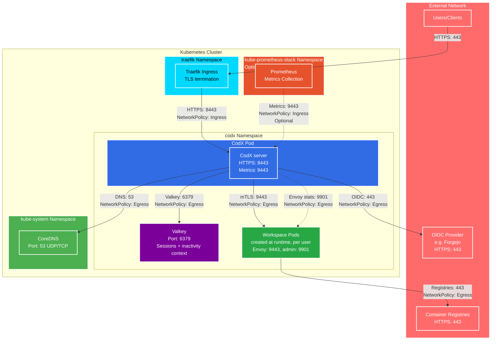

# Helm chart for codx

[CodX](https://github.com/captnbp/codx) runs an isolated, per-user code-server workspace on Kubernetes: OIDC login, per-user pod, TLS certificate and persistent home directory. This chart deploys the CodX server, its Valkey session store, the Traefik objects for the mTLS admin fallback, and the optional Grafana dashboard.

## Architecture

The following diagram illustrates the codx Helm chart architecture with network flows when NetworkPolicies are enabled:



### Network Flow Legend

- **Solid lines**: Required network flows
- **Dashed lines**: Optional network flows (configurable)
- **NetworkPolicy labels**: Indicate which NetworkPolicy rule controls the flow

### Key Components

1. **CodX server**
   - Serves the web UI and API on HTTPS 8443, behind the Traefik ingress
   - Authenticates users against the OIDC provider (HTTPS 443)
   - Stores sessions and the inactivity tracking context in Valkey (6379)
   - Proxies the authenticated user to their workspace over mutual TLS
     (Envoy sidecar 9443) and polls the Envoy admin interface (9901) for
     the inactivity watcher

2. **Valkey**
   - Session store shared by the CodX replicas
   - Persistence of the inactivity tracking context and of the last-login
     records of the users

3. **Workspace pods** (created at runtime, one per user)
   - code-server container with the user's PVC mounted at /home/coder
   - Envoy TLS termination sidecar (9443) with an admin interface (9901)

4. **Network Policies**
   - Control ingress and egress traffic for the CodX server and the workspace
     pods
   - Disabled by default for the CodX server; enable with
     `networkPolicy.codx.enabled` (the workspace policy is enabled by default)

5. **Monitoring (Optional)**
   - Prometheus scrapes the CodX metrics endpoint (9443) and the Valkey
     exporter when `metrics.serviceMonitor.enabled` is set
   - Requires allowing the monitoring namespace in the NetworkPolicy
     configuration

## TL;DR

```console
$ helm install my-release oci://registry-1.docker.io/captnbp/codx
```

## Prerequisites

- Kubernetes 1.30+
- Helm 3.2.0+
- PV provisioner support in the underlying infrastructure
- [cert-manager](https://cert-manager.io/)

## Installing the Chart

To install the chart with the release name `my-release`:

```console
$ helm install my-release oci://registry-1.docker.io/captnbp/codx
```

These commands deploy codx on the Kubernetes cluster in the default configuration. The [Parameters](#parameters) section lists the parameters that can be configured during installation.

> **Tip**: List all releases using `helm list`

## Uninstalling the Chart

To uninstall/delete the `my-release` release:

```console
$ helm delete my-release
```

The command removes all the Kubernetes components associated with the chart and deletes the release. Remove also the chart using `--purge` option:

```console
$ helm delete --purge my-release
```


## Parameters

### Global parameters

| Name                      | Description                                                                                                                                                          | Value |
| ------------------------- | -------------------------------------------------------------------------------------------------------------------------------------------------------------------- | ----- |
| `global.imageRegistry`    | Global Docker image registry                                                                                                                                         | `""`  |
| `global.imagePullSecrets` | Global Docker registry secret names as an array. Also used as the fallback image pull secrets of workspace pods whose Profile does not set podSpec.imagePullSecrets. | `[]`  |
| `global.storageClass`     | Global StorageClass for Persistent Volume(s)                                                                                                                         | `""`  |

### Common parameters

| Name                     | Description                                                                                                                                                                                               | Value           |
| ------------------------ | --------------------------------------------------------------------------------------------------------------------------------------------------------------------------------------------------------- | --------------- |
| `nameOverride`           | String to partially override common.names.fullname template (will maintain the release name)                                                                                                              | `""`            |
| `fullnameOverride`       | String to fully override common.names.fullname template                                                                                                                                                   | `""`            |
| `instanceName`           | CodX instance name used to build workspace object names (<instance>-<slug> for Services, PVCs, Certificates, Pods) and the app.kubernetes.io/managed-by label. Defaults to the chart fullname when empty. | `""`            |
| `commonLabels`           | Labels to add to all deployed objects                                                                                                                                                                     | `{}`            |
| `commonAnnotations`      | Annotations to add to all deployed objects                                                                                                                                                                | `{}`            |
| `kubeVersion`            | Force target Kubernetes version (using Helm capabilities if not set)                                                                                                                                      | `""`            |
| `clusterDomain`          | Default Kubernetes cluster domain                                                                                                                                                                         | `cluster.local` |
| `extraDeploy`            | Array of extra objects to deploy with the release                                                                                                                                                         | `[]`            |
| `diagnosticMode.enabled` | Enable diagnostic mode (all probes will be disabled and the command will be overridden)                                                                                                                   | `false`         |
| `diagnosticMode.command` | Command to override all containers in the chart release                                                                                                                                                   | `["sleep"]`     |
| `diagnosticMode.args`    | Args to override all containers in the chart release                                                                                                                                                      | `["infinity"]`  |

### codx parameters

| Name                 | Description                                                                 | Value          |
| -------------------- | --------------------------------------------------------------------------- | -------------- |
| `image.registry`     | codx image registry                                                         | `ghcr.io`      |
| `image.repository`   | codx image repository                                                       | `captnbp/codx` |
| `image.tag`          | codx image tag (immutable tags are recommended)                             | `main`         |
| `image.pullPolicy`   | Image pull policy                                                           | `IfNotPresent` |
| `image.pullSecrets`  | Specify docker-registry secret names as an array                            | `[]`           |
| `image.debug`        | Specify if debug logs should be enabled                                     | `false`        |
| `extraEnvVars`       | Extra environment variables to be set on codx container                     | `{}`           |
| `extraEnvVarsCM`     | ConfigMap with extra environment variables                                  | `""`           |
| `extraEnvVarsSecret` | Secret with extra environment variables                                     | `""`           |
| `command`            | Default container command (useful when using custom images). Use array form | `[]`           |
| `args`               | Default container args (useful when using custom images). Use array form    | `[]`           |

### codx deployment/statefulset parameters

| Name                                                | Description                                                                                           | Value            |
| --------------------------------------------------- | ----------------------------------------------------------------------------------------------------- | ---------------- |
| `schedulerName`                                     | Specifies the schedulerName, if it's nil uses kube-scheduler                                          | `""`             |
| `updateStrategy.type`                               | codxwarden statefulset strategy type                                                                  | `RollingUpdate`  |
| `updateStrategy.rollingUpdate`                      | codxwarden statefulset rolling update configuration parameters                                        | `{}`             |
| `hostAliases`                                       | codx pod host aliases                                                                                 | `[]`             |
| `containerPorts.https`                              | codx container port to open for codx https                                                            | `8443`           |
| `podSecurityContext.enabled`                        | Enable pod Security Context                                                                           | `true`           |
| `podSecurityContext.fsGroup`                        | Group ID for the container                                                                            | `65532`          |
| `podSecurityContext.seccompProfile.type`            | Type of seccomp profile to use                                                                        | `RuntimeDefault` |
| `containerSecurityContext.enabled`                  | Enable container Security Context                                                                     | `true`           |
| `containerSecurityContext.runAsUser`                | User ID for the container                                                                             | `65532`          |
| `containerSecurityContext.runAsNonRoot`             | Avoid running as root User                                                                            | `true`           |
| `containerSecurityContext.allowPrivilegeEscalation` | Allow privilege escalation                                                                            | `false`          |
| `containerSecurityContext.readOnlyRootFilesystem`   | Read-only root filesystem                                                                             | `true`           |
| `containerSecurityContext.capabilities.drop`        | Capabilities to drop                                                                                  | `["ALL"]`        |
| `containerSecurityContext.capabilities.add`         | Capabilities to add                                                                                   | `[]`             |
| `podLabels`                                         | Extra labels for codx pods                                                                            | `{}`             |
| `podAnnotations`                                    | Annotations for codx pods                                                                             | `{}`             |
| `podAffinityPreset`                                 | Pod affinity preset. Ignored if `affinity` is set. Allowed values: `soft` or `hard`                   | `""`             |
| `podAntiAffinityPreset`                             | Pod anti-affinity preset. Ignored if `affinity` is set. Allowed values: `soft` or `hard`              | `soft`           |
| `nodeAffinityPreset.type`                           | Node affinity preset type. Ignored if `affinity` is set. Allowed values: `soft` or `hard`             | `""`             |
| `nodeAffinityPreset.key`                            | Node label key to match. Ignored if `affinity` is set.                                                | `""`             |
| `nodeAffinityPreset.values`                         | Node label values to match. Ignored if `affinity` is set.                                             | `[]`             |
| `affinity`                                          | Affinity for pod assignment. Evaluated as a template.                                                 | `{}`             |
| `nodeSelector`                                      | Node labels for pod assignment. Evaluated as a template.                                              | `{}`             |
| `tolerations`                                       | Tolerations for pod assignment. Evaluated as a template.                                              | `[]`             |
| `topologySpreadConstraints`                         | Topology Spread Constraints for codx pods assignment spread across your cluster among failure-domains | `[]`             |
| `priorityClassName`                                 | codx pods' priorityClassName                                                                          | `""`             |
| `resources.limits`                                  | The resources limits for the codx container                                                           | `{}`             |
| `resources.requests`                                | The requested resources for the codx container                                                        | `{}`             |
| `replicas`                                          | Number of CodX replicas                                                                               | `1`              |

### Exposure parameters

| Name                               | Description                                                                                                                                                                                                                                                                                                     | Value                    |
| ---------------------------------- | --------------------------------------------------------------------------------------------------------------------------------------------------------------------------------------------------------------------------------------------------------------------------------------------------------------- | ------------------------ |
| `service.type`                     | Kubernetes service type                                                                                                                                                                                                                                                                                         | `ClusterIP`              |
| `service.ports.https`              | codx service HTTPS port                                                                                                                                                                                                                                                                                         | `8443`                   |
| `service.nodePorts`                | Specify the nodePort values for the LoadBalancer and NodePort service types.                                                                                                                                                                                                                                    | `{}`                     |
| `service.sessionAffinity`          | Control where client requests go, to the same pod or round-robin                                                                                                                                                                                                                                                | `None`                   |
| `service.sessionAffinityConfig`    | Additional settings for the sessionAffinity                                                                                                                                                                                                                                                                     | `{}`                     |
| `service.clusterIP`                | codx service clusterIP IP                                                                                                                                                                                                                                                                                       | `""`                     |
| `service.loadBalancerIP`           | loadBalancerIP for the CodX service (optional, cloud specific)                                                                                                                                                                                                                                              | `""`                     |
| `service.loadBalancerSourceRanges` | Address that are allowed when service is LoadBalancer                                                                                                                                                                                                                                                           | `[]`                     |
| `service.externalTrafficPolicy`    | Enable client source IP preservation                                                                                                                                                                                                                                                                            | `Cluster`                |
| `service.annotations`              | Additional custom annotations for codx service                                                                                                                                                                                                                                                                  | `{}`                     |
| `service.extraPorts`               | Extra port to expose on codx service                                                                                                                                                                                                                                                                            | `[]`                     |
| `service.extraHeadlessPorts`       | Extra ports to expose on codx headless service                                                                                                                                                                                                                                                                  | `[]`                     |
| `service.ipFamilyPolicy`           | Controller Service ipFamilyPolicy (optional, cloud specific)                                                                                                                                                                                                                                                    | `PreferDualStack`        |
| `service.ipFamilies`               | Controller Service ipFamilies (optional, cloud specific)                                                                                                                                                                                                                                                        | `["IPv6","IPv4"]`        |
| `ingress.enabled`                  | Enable ingress record generation for codx                                                                                                                                                                                                                                                                       | `true`                   |
| `ingress.pathType`                 | Ingress path type                                                                                                                                                                                                                                                                                               | `ImplementationSpecific` |
| `ingress.apiVersion`               | Force Ingress API version (automatically detected if not set)                                                                                                                                                                                                                                                   | `""`                     |
| `ingress.hostname`                 | Default host for the ingress record                                                                                                                                                                                                                                                                             | `codx.local`             |
| `ingress.ingressClassName`         | IngressClass that will be be used to implement the Ingress (Kubernetes 1.18+)                                                                                                                                                                                                                                   | `traefik`                |
| `ingress.ingressControllerType`    | ingressControllerType that will be be used to implement the Ingress specific annotations (Ex. nginx or traefik)                                                                                                                                                                                                 | `traefik`                |
| `ingress.path`                     | Default path for the ingress record                                                                                                                                                                                                                                                                             | `/`                      |
| `ingress.annotations`              | Additional annotations for the Ingress resource. To enable certificate autogeneration, place here your cert-manager annotations.                                                                                                                                                                                | `{}`                     |
| `ingress.extraMiddlewares`         | Extra Traefik middlewares appended to the traefik.ingress.kubernetes.io/router.middlewares annotation, after any user-defined middlewares and the chart passTLSClientCert middleware (when traefikMtls.enabled). Entries are middleware references; the "@kubernetescrd" provider suffix is added when missing. | `[]`                     |
| `ingress.tls`                      | Enable TLS configuration for the host defined at `ingress.hostname` parameter                                                                                                                                                                                                                                   | `false`                  |
| `ingress.selfSigned`               | Create a TLS secret for this ingress record using self-signed certificates generated by Helm                                                                                                                                                                                                                    | `false`                  |
| `ingress.extraHosts`               | An array with additional hostname(s) to be covered with the ingress record                                                                                                                                                                                                                                      | `[]`                     |
| `ingress.extraPaths`               | An array with additional arbitrary paths that may need to be added to the ingress under the main host                                                                                                                                                                                                           | `[]`                     |
| `ingress.extraTls`                 | TLS configuration for additional hostname(s) to be covered with this ingress record                                                                                                                                                                                                                             | `[]`                     |
| `ingress.secrets`                  | Custom TLS certificates as secrets                                                                                                                                                                                                                                                                              | `[]`                     |
| `ingress.extraRules`               | Additional rules to be covered with this ingress record                                                                                                                                                                                                                                                         | `[]`                     |

### RBAC parameter

| Name                                          | Description                                                 | Value  |
| --------------------------------------------- | ----------------------------------------------------------- | ------ |
| `serviceAccount.create`                       | Enable the creation of a ServiceAccount for codxwarden pods | `true` |
| `serviceAccount.name`                         | Name of the created ServiceAccount                          | `""`   |
| `serviceAccount.automountServiceAccountToken` | Auto-mount the service account token in the pod             | `true` |
| `serviceAccount.annotations`                  | Additional custom annotations for the ServiceAccount        | `{}`   |

### Global TLS settings for internal CA

| Name                                                             | Description                                                                                | Value             |
| ---------------------------------------------------------------- | ------------------------------------------------------------------------------------------ | ----------------- |
| `tls.enabled`                                                    | Enable the chart-internal TLS: the self-signed CA issuer and the cert-manager certificates (CodX server, client certificate for the workspace mTLS proxy, Valkey)                                   | `true`            |
| `tls.autoGenerated`                                              | Create cert-manager signed TLS certificates.                                               | `true`            |
| `tls.existingSecret`                                             | Existing secret named "<fullname>-server-tls" with the certificates for the CodX server (skips the cert-manager Certificate creation)                                      | `""`              |
| `tls.subject.organizationalUnits`                                | Subject's organizational units                                                             | `codx`            |
| `tls.subject.organizations`                                      | Subject's organization                                                                     | `codx`            |
| `tls.subject.countries`                                          | Subject's country                                                                          | `fr`              |
| `tls.issuerRef.existingIssuerName`                               | Existing name of the cert-manager http issuer. If provided, it won't create a default one. | `""`              |
| `tls.issuerRef.kind`                                             | Kind of the cert-manager issuer resource (defaults to "Issuer")                            | `Issuer`          |
| `tls.issuerRef.group`                                            | Group of the cert-manager issuer resource (defaults to "cert-manager.io")                  | `cert-manager.io` |
| `tls.serverCertDir`                                              | Directory where the CodX server certificate is mounted (from cert-manager)                 | `/tls`            |
| `tls.clientCertDir`                                              | Directory where the CodX client certificate is mounted (from cert-manager)                 | `/tls/client`     |
| `tls.caDir`                                                      | Directory where the CA certificate is mounted (from cert-manager)                          | `/tls`            |
| `valkey.enabled`                                                 | Enable Valkey integration for CodX                                                         | `false`           |
| `valkey.resources`                                               | Resources for the Valkey container                                                         | `{}`              |
| `valkey.dataStorage.enabled`                                     | Enable persistent volume claim creation                                                    | `false`           |
| `valkey.dataStorage.persistentVolumeClaimName`                   | Use an existing PVC by name (skip dynamic provisioning if set)                             | `""`              |
| `valkey.dataStorage.subPath`                                     | Subpath inside the PVC to mount                                                            | `""`              |
| `valkey.dataStorage.volumeName`                                  | Name of the volume (referenced in the deployment)                                          | `valkey-data`     |
| `valkey.dataStorage.requestedSize`                               | Request size (e.g. 5Gi) for a dynamically provisioned volume                               | `""`              |
| `valkey.dataStorage.className`                                   | Name of the storage class to use                                                           | `""`              |
| `valkey.valkeyConfig`                                            | Content for valkey.conf (mounted via ConfigMap)                                            | `""`              |
| `valkey.auth.enabled`                                            | Enable ACL-based authentication.                                                           | `false`           |
| `valkey.auth.usersExistingSecret`                                | Use an existing secret for user passwords. Key defaults to username.                       | `""`              |
| `valkey.auth.aclUsers`                                           | Map of users to create with ACL permissions.                                               | `{}`              |
| `valkey.auth.aclConfig`                                          | Inline ACL configuration that will be appended after the generated users.                  | `""`              |
| `valkey.replica.enabled`                                         | Enable master-replica replication mode                                                     | `false`           |
| `valkey.tls.enabled`                                             | Enable TLS                                                                                 | `true`            |
| `valkey.tls.existingSecret`                                      | Name of the Secret containing the TLS keys (required)                                      | `codx-valkey-tls` |
| `valkey.tls.serverPublicKey`                                     | Secret key name containing the server public certificate                                   | `tls.crt`         |
| `valkey.tls.serverKey`                                           | Secret key name containing the server private key                                          | `tls.key`         |
| `valkey.tls.caPublicKey`                                         | Secret key name containing the Certificate Authority public certificate                    | `ca.crt`          |
| `valkey.tls.requireClientCertificate`                            | Require that clients authenticate with a certificate                                       | `false`           |
| `valkey.metrics.enabled`                                         | Enable the Prometheus exporter sidecar                                                     | `true`            |
| `valkey.metrics.exporter.resources`                              | Resources for the Valkey Prometheus exporter container                                     | `{}`              |
| `valkey.metrics.exporter.extraEnvs`                              | Extra environment variables for the Valkey Prometheus exporter container                   | `{}`              |
| `valkey.metrics.exporter.securityContext.runAsNonRoot`           | Run the Valkey Prometheus exporter as a non-root user                                      | `true`            |
| `valkey.metrics.exporter.securityContext.runAsUser`              | User ID for the Valkey Prometheus exporter container                                       | `1000`            |
| `valkey.metrics.exporter.securityContext.runAsGroup`             | Group ID for the Valkey Prometheus exporter container                                      | `1000`            |
| `valkey.metrics.exporter.securityContext.capabilities.drop`      | Capabilities to drop for the Valkey Prometheus exporter container                          | `[]`              |
| `valkey.metrics.exporter.securityContext.readOnlyRootFilesystem` | Read-only root filesystem for the Valkey Prometheus exporter container                     | `true`            |
| `valkey.metrics.serviceMonitor.enabled`                          | Create a ServiceMonitor resource for scraping service metrics                              | `true`            |
| `valkey.metrics.podMonitor.enabled`                              | Create a PodMonitor resource for scraping pod metrics                                      | `false`           |
| `valkey.metrics.prometheusRule.enabled`                          | Enable creation of the PrometheusRule resource                                             | `false`           |
| `valkey.metrics.prometheusRule.extraLabels`                      | Extra labels to add to the PrometheusRule resource                                         | `{}`              |
| `valkey.metrics.prometheusRule.extraAnnotations`                 | Extra annotations to add to the PrometheusRule resource                                    | `{}`              |
| `valkey.metrics.prometheusRule.rules`                            | List of Prometheus alerting rules                                                          | `[]`              |

### Cert Manager

| Name                   | Description                                                        | Value   |
| ---------------------- | ------------------------------------------------------------------ | ------- |
| `certManager.renewal`  | Certificate renewal period before expiry (Go duration, e.g. 720h). | `720h`  |
| `certManager.validity` | Certificate validity duration (Go duration, e.g. 2160h).           | `2160h` |

### CodX HTTP Server

| Name               | Description                                                                                                | Value          |
| ------------------ | ---------------------------------------------------------------------------------------------------------- | -------------- |
| `http.listenAddr`  | Address the HTTP server binds to. Supports IPv4 (e.g. 0.0.0.0:8443), IPv6 (e.g. [::]:8443) and dual-stack. | `[::]:8443`    |
| `http.tlsCertFile` | Path to the TLS certificate for the CodX server (TLS is mandatory).                                        | `/tls/tls.crt` |
| `http.tlsKeyFile`  | Path to the TLS key for the CodX server (TLS is mandatory).                                                | `/tls/tls.key` |

### Metrics parameters

| Name                                   | Description                                                                                              | Value  |
| -------------------------------------- | -------------------------------------------------------------------------------------------------------- | ------ |
| `metrics.enabled`                      | Enable the dedicated Prometheus /metrics endpoint (configured via the CodX ConfigMap)                    | `true` |
| `metrics.port`                         | Port of the dedicated metrics endpoint                                                                   | `9443` |
| `metrics.tls`                          | Enable TLS on the metrics endpoint using the CodX server certificate (configured via the CodX ConfigMap) | `true` |
| `metrics.serviceMonitor.enabled`       | Create a ServiceMonitor resource for Prometheus Operator                                                 | `true` |
| `metrics.serviceMonitor.interval`      | Scrape interval for the ServiceMonitor                                                                   | `30s`  |
| `metrics.serviceMonitor.scrapeTimeout` | Scrape timeout for the ServiceMonitor                                                                    | `10s`  |
| `metrics.serviceMonitor.labels`        | Extra labels for the ServiceMonitor resource                                                             | `{}`   |

### Grafana dashboards

| Name                            | Description                                                                                            | Value               |
| ------------------------------- | ------------------------------------------------------------------------------------------------------ | ------------------- |
| `grafanaDashboards.enabled`     | Create the ConfigMap with the workspaces dashboard.                                                    | `false`             |
| `grafanaDashboards.label`       | Label key watched by the Grafana dashboard sidecar (kube-prometheus-stack default: grafana_dashboard). | `grafana_dashboard` |
| `grafanaDashboards.folder`      | Grafana folder imported by the sidecar (grafana_folder label).                                         | `CodX`              |
| `grafanaDashboards.annotations` | Annotations for the dashboard ConfigMap.                                                               | `{}`                |

### OIDC Authentication

| Name                     | Description                                                                                 | Value                |
| ------------------------ | ------------------------------------------------------------------------------------------- | -------------------- |
| `oidc.issuer`            | OIDC issuer URL (e.g. https://keycloak.example.com/realms/myrealm).                         | `""`                 |
| `oidc.clientId`          | OAuth2 client ID registered with the OIDC provider.                                         | `""`                 |
| `oidc.clientSecret`      | OAuth2 client secret. Can also be set via the CODX_OIDC_CLIENT_SECRET environment variable. | `""`                 |
| `oidc.groupClaimName`    | Name of the custom claim in the ID token that contains the user's group memberships.        | `groups`             |
| `oidc.adminGroup`        | OIDC group whose members get admin privileges.                                              | `codx-admins`        |
| `oidc.usernameClaimName` | ID token claim used as the username source for slug generation.                             | `preferred_username` |

### Session

| Name          | Description                                                                  | Value |
| ------------- | ---------------------------------------------------------------------------- | ----- |
| `session.ttl` | How long a session stays valid after login (Go duration, e.g. 12h, 8h, 30m). | `12h` |

### mTLS Fallback Authentication

| Name                      | Description                                                                         | Value                              |
| ------------------------- | ----------------------------------------------------------------------------------- | ---------------------------------- |
| `authFallback.enabled`    | Enable the mTLS client-certificate fallback authentication for admins.              | `false`                            |
| `authFallback.headerName` | HTTP header carrying the escaped client certificate information.                    | `X-Forwarded-Tls-Client-Cert-Info` |
| `authFallback.adminCns`   | Client certificate Common Names allowed to authenticate as admins via the fallback. | `[]`                               |

### Traefik mTLS objects

| Name                                             | Description                                                                                                                                                                                              | Value                     |
| ------------------------------------------------ | -------------------------------------------------------------------------------------------------------------------------------------------------------------------------------------------------------- | ------------------------- |
| `traefikMtls.enabled`                            | Create the client CA Secret, TLSOption and passTLSClientCert Middleware.                                                                                                                                 | `false`                   |
| `traefikMtls.apiVersion`                         | API version of the Traefik CRDs: traefik.io/v1alpha1 (Traefik v3, default) or traefik.containo.us/v1alpha1 (Traefik v2).                                                                                 | `traefik.io/v1alpha1`     |
| `traefikMtls.existingCaSecret`                   | Existing secret with the client CA certificate (key ca.crt), e.g. the chart internal CA "<fullname>-ca-crt". When empty, a Secret is created from traefikMtls.caCertificates.                            | `""`                      |
| `traefikMtls.caCertificates`                     | PEM-encoded client CA certificate(s) for the created Secret. Use --set-file or prefer existingCaSecret.                                                                                                  | `""`                      |
| `traefikMtls.annotations`                        | Annotations added to the created client CA Secret.                                                                                                                                                       | `{}`                      |
| `traefikMtls.tlsOption.name`                     | Name of the TLSOption. Defaults to "<fullname>-client-mtls".                                                                                                                                             | `""`                      |
| `traefikMtls.tlsOption.annotations`              | Annotations for the TLSOption.                                                                                                                                                                           | `{}`                      |
| `traefikMtls.tlsOption.clientAuthType`           | Client certificate policy: VerifyClientCertIfGiven (default, keeps the OIDC flow working for browsers without a client certificate), RequireAndVerifyClientCert, RequireClientCert or RequestClientCert. | `VerifyClientCertIfGiven` |
| `traefikMtls.middleware.name`                    | Name of the Middleware. Defaults to "<fullname>-passtlsclientcert".                                                                                                                                      | `""`                      |
| `traefikMtls.middleware.annotations`             | Annotations for the Middleware.                                                                                                                                                                          | `{}`                      |
| `traefikMtls.middleware.pem`                     | Also forward the full client certificate (PEM) in the X-Forwarded-Tls-Client-Cert header.                                                                                                                | `false`                   |
| `traefikMtls.middleware.info.subject.commonName` | Forward the subject common name in the X-Forwarded-Tls-Client-Cert-Info header. Required by the CodX mTLS fallback.                                                                                      | `true`                    |

### Redis/Valkey Session Store

| Name               | Description                                                                                                                     | Value         |
| ------------------ | ------------------------------------------------------------------------------------------------------------------------------- | ------------- |
| `redis.host`       | Redis hostname (host:port).                                                                                                     | `""`          |
| `redis.password`   | Optional Redis password. Can also be set via the CODX_REDIS_PASSWORD environment variable.                                      | `""`          |
| `redis.db`         | Redis logical database index.                                                                                                   | `0`           |
| `redis.tls`        | Enable TLS to Redis. Automatically enabled when caFilePath is set.                                                              | `true`        |
| `redis.caFilePath` | Path to a PEM-encoded CA certificate file used to verify the Redis TLS certificate. Typically mounted from a Kubernetes secret. | `/tls/ca.crt` |

### Username Slug

| Name                 | Description                                                         | Value                |
| -------------------- | ------------------------------------------------------------------- | -------------------- |
| `slug.usernameField` | OIDC claim used as the username source.                             | `preferred_username` |
| `slug.maxLength`     | Maximum length of the generated slug (Kubernetes label/name limit). | `63`                 |

### Inactivity Watcher

| Name                                        | Description                                                                                                | Value  |
| ------------------------------------------- | ---------------------------------------------------------------------------------------------------------- | ------ |
| `inactivity.checkInterval`                  | How often the watcher polls connections and checks for idle workspaces (Go duration, e.g. 60s).            | `60s`  |
| `inactivity.leaderElection.enabled`         | Elect a single inactivity monitor via a Kubernetes Lease. Must be enabled with more than one CodX replica. | `true` |
| `inactivity.leaderElection.leaseName`       | Name of the Lease object used for the election. Defaults to "<instanceName>-inactivity".                   | `""`   |
| `inactivity.leaderElection.leaseNamespace`  | Namespace of the Lease object. Defaults to the namespace CodX runs in.                                     | `""`   |
| `inactivity.leaderElection.leaseDuration`   | How long a non-leader waits before taking over an unresponsive leader (Go duration).                       | `15s`  |
| `inactivity.leaderElection.renewDeadline`   | How long the leader retries renewing the lease before giving up (Go duration).                             | `10s`  |
| `inactivity.leaderElection.retryPeriod`     | Interval between lease (re)acquisition attempts (Go duration).                                             | `2s`   |
| `inactivity.leaderElection.releaseOnCancel` | Release the lease immediately on graceful shutdown.                                                        | `true` |

### Workspace Service

| Name                              | Description                                                           | Value             |
| --------------------------------- | --------------------------------------------------------------------- | ----------------- |
| `workspaceService.annotations`    | Extra annotations to add to every workspace Service.                  | `{}`              |
| `workspaceService.ipFamilies`     | List of IP families (e.g. IPv4, IPv6) assigned to workspace Services. | `["IPv6","IPv4"]` |
| `workspaceService.ipFamilyPolicy` | Dual-stack-ness requested or required by workspace Services.          | `PreferDualStack` |

### Workspace

| Name                             | Description                                                   | Value                                      |
| -------------------------------- | ------------------------------------------------------------- | ------------------------------------------ |
| `workspace.envoyImage`           | Image for the Envoy TLS termination sidecar in workspace pods | `envoyproxy/envoy:distroless-v1.39-latest` |
| `workspace.tracing.enabled`      | Enable OpenTelemetry tracing in the workspace Envoy sidecar   | `false`                                    |
| `workspace.tracing.otlpEndpoint` | OpenTelemetry collector endpoint (OTLP gRPC, host:port)       | `""`                                       |
| `workspace.tracing.serviceName`  | OpenTelemetry service name reported for workspace requests    | `codx-workspace`                           |

### Tracing

| Name                                                                 | Description                                                                                 | Value                                   |
| -------------------------------------------------------------------- | ------------------------------------------------------------------------------------------- | --------------------------------------- |
| `tracing.enabled`                                                    | Enable OpenTelemetry tracing for the CodX server                                            | `false`                                 |
| `tracing.otlpEndpoint`                                               | OpenTelemetry collector endpoint (OTLP/HTTP, host:port, usually port 4318)                  | `""`                                    |
| `tracing.serviceName`                                                | OpenTelemetry service name reported for the CodX server                                     | `codx`                                  |
| `profiles.default.title`                                             | Title of the default profile, shown in the profile picker.                                  | `Default`                               |
| `profiles.default.description`                                       | Description of the default profile, shown in the profile picker.                            | `Standard code-server workspace`        |
| `profiles.default.inactivityStopDelaySeconds`                        | Seconds of inactivity after which the default profile's workspaces are stopped (0 = never). | `120`                                   |
| `profiles.default.oidcGroups`                                        | OIDC groups allowed to use the default profile (empty = all authenticated users).           | `[]`                                    |
| `profiles.default.podSpec.image`                                     | code-server image of the default profile.                                                   | `docker.io/captnbp/code-server:4.140.0` |
| `profiles.default.podSpec.securityContext.runAsUser`                 | User ID of the code-server container.                                                       | `1000`                                  |
| `profiles.default.podSpec.securityContext.runAsGroup`                | Group ID of the code-server container.                                                      | `1000`                                  |
| `profiles.default.podSpec.securityContext.fsGroup`                   | Group ID of the volumes mounted by the code-server container.                               | `1000`                                  |
| `profiles.default.podSpec.resources.limits.cpu`                      | CPU limit of the code-server container.                                                     | `2`                                     |
| `profiles.default.podSpec.resources.limits.memory`                   | Memory limit of the code-server container.                                                  | `4Gi`                                   |
| `profiles.default.podSpec.resources.requests.cpu`                    | CPU request of the code-server container.                                                   | `250m`                                  |
| `profiles.default.podSpec.resources.requests.memory`                 | Memory request of the code-server container.                                                | `650Mi`                                 |
| `profiles.default.podSpec.args`                                      | Args of the code-server container of the default profile.                                   | `[]`                                    |
| `profiles.default.podSpec.command`                                   | Command of the code-server container of the default profile.                                | `[]`                                    |
| `profiles.default.podSpec.codeServerReadinessProbe.exec.command`     | Exec command of the code-server readiness probe.                                            | `[]`                                    |
| `profiles.default.pvc.size`                                          | Size of the default profile's per-user PVC.                                                 | `20Gi`                                  |
| `networkPolicy.codx.enabled`                                         | Enable the NetworkPolicy for the CodX codx                                                  | `false`                                 |
| `networkPolicy.codx.ingress.fromIngressController.enabled`           | Allow traffic from the Ingress Controller                                                   | `true`                                  |
| `networkPolicy.codx.ingress.fromIngressController.namespaceSelector` | Namespace selector for the Ingress Controller                                               | `{}`                                    |
| `networkPolicy.codx.ingress.fromIngressController.podSelector`       | Pod selector for the Ingress Controller                                                     | `{}`                                    |
| `networkPolicy.codx.ingress.fromMonitoring.enabled`                  | Allow traffic from the monitoring namespace (requires metrics.enabled)                      | `true`                                  |
| `networkPolicy.codx.ingress.fromMonitoring.namespaceSelector`        | Namespace selector for monitoring                                                           | `{}`                                    |
| `networkPolicy.codx.ingress.fromMonitoring.podSelector`              | Pod selector for monitoring                                                                 | `{}`                                    |
| `networkPolicy.codx.ingress.extraIngress`                            | Extra ingress rules for the codx                                                            | `[]`                                    |
| `networkPolicy.codx.egress.toKubeAPI.enabled`                        | Allow traffic to the Kubernetes API                                                         | `true`                                  |
| `networkPolicy.codx.egress.toKubeAPI.port`                           | Port of the Kubernetes API                                                                  | `443`                                   |
| `networkPolicy.codx.egress.toKubeAPI.cidrBlocks`                     | CIDR blocks of the Kubernetes API endpoints                                                 | `["0.0.0.0/0","::/0"]`                  |
| `networkPolicy.codx.egress.toWorkspaces.enabled`                     | Allow mTLS traffic to the workspace Envoy sidecars                                          | `true`                                  |
| `networkPolicy.codx.egress.toWorkspaces.port`                        | Port of the workspace Envoy sidecars                                                        | `9443`                                  |
| `networkPolicy.codx.egress.toValkey.enabled`                         | Allow traffic to the Valkey pods (requires valkey.enabled)                                  | `true`                                  |
| `networkPolicy.codx.egress.toValkey.port`                            | Port of the Valkey pods                                                                     | `6379`                                  |
| `networkPolicy.codx.egress.toInternet.enabled`                       | Allow traffic to the Internet (OIDC issuer, ...)                                            | `true`                                  |
| `networkPolicy.codx.egress.toInternet.cidrBlocks`                    | CIDR blocks for the Internet                                                                | `["0.0.0.0/0","::/0"]`                  |
| `networkPolicy.codx.egress.toInternet.ports`                         | Internet ports to allow                                                                     | `[]`                                    |
| `networkPolicy.codx.egress.extraEgress`                              | Extra egress rules for the codx                                                             | `[]`                                    |
| `networkPolicy.workspace.enabled`                                    | Enable the NetworkPolicy for the workspace pods                                             | `true`                                  |
| `networkPolicy.workspace.ingress.fromCodX.enabled`                   | Allow mTLS traffic from the CodX codx                                                       | `true`                                  |
| `networkPolicy.workspace.ingress.fromCodX.port`                      | Port of the workspace Envoy sidecar                                                         | `9443`                                  |
| `networkPolicy.workspace.ingress.fromNode.enabled`                   | Allow kubelet readiness probes (code-server /healthz and Envoy /ready)                      | `false`                                 |
| `networkPolicy.workspace.ingress.fromNode.cidrBlocks`                | CIDR blocks the kubelet probes originate from                                               | `["0.0.0.0/0","::/0"]`                  |
| `networkPolicy.workspace.ingress.extraIngress`                       | Extra ingress rules for the workspace pods                                                  | `[]`                                    |
| `networkPolicy.workspace.egress.toInternet.enabled`                  | Allow traffic to the Internet (registries, extensions, docs)                                | `true`                                  |
| `networkPolicy.workspace.egress.toInternet.cidrBlocks`               | CIDR blocks for the Internet                                                                | `["0.0.0.0/0","::/0"]`                  |
| `networkPolicy.workspace.egress.toInternet.ports`                    | Internet ports to allow                                                                     | `[]`                                    |
| `networkPolicy.workspace.egress.extraEgress`                         | Extra egress rules for the workspace pods                                                   | `[]`                                    |

## License

[MIT](./LICENSE).

## Author

This Helm chart was created and is being maintained by @captnbp.

### Credits

- The `codxo` project can be found [here](https://github.com/captnbp/codx)
codxcodx
